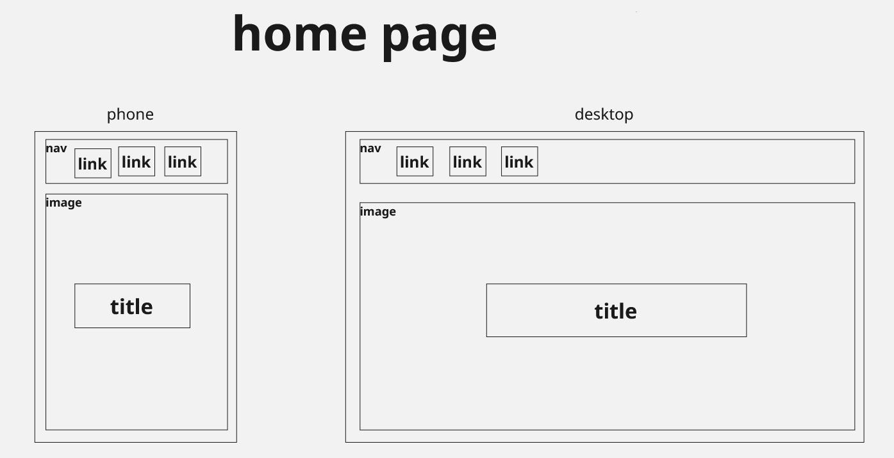
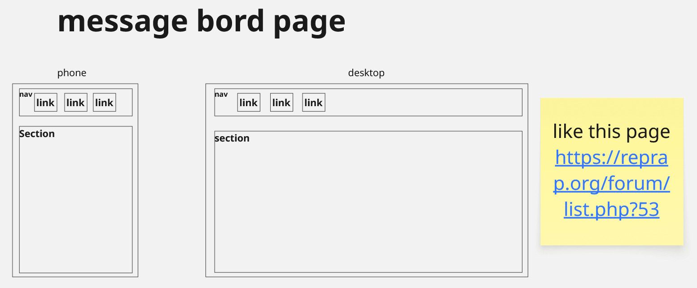
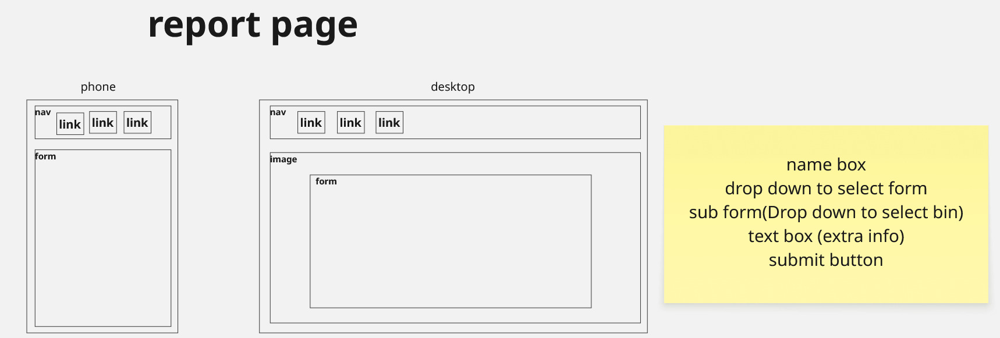
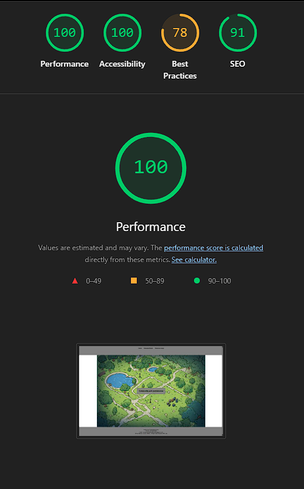
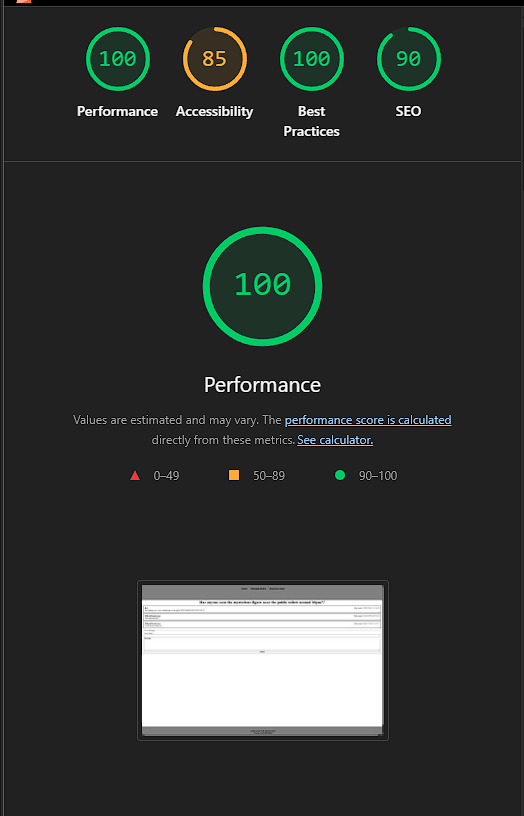
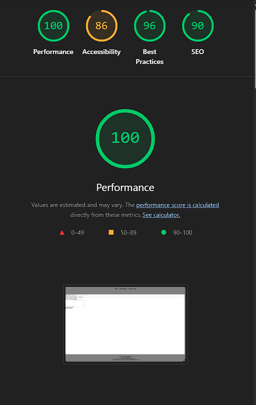

Project name:
Park Community Website

Render links:
https://commumity-client.onrender.com
https://commumity-server.onrender.com

Repo link:
https://github.com/siteatis/assignment-week05

Team members:
Luke
Jason
Ryan

Project description:
commumity park site to report bin that need emptying and chat forms

Problem domain:
commumity park site to report bin that need emptying and chat forms

User stories:
as a user i want to report a overflow bin so that it will be empied
as a user i want a page to discuss issues within the park so that as a commumity we cant resole them
as a user i want to accsecs the site on me phone so that i can reprot as im out
as a user i waht the home page to be clean and ease to navaget so that i can find the pages i need
as a developer i want to see clead an ease to read code so that i know what it is doing

Wireframe:

libraries:
cors
dotenv
express
pg
vite

Instructions on how to run your app:
in server npm i then node server
in client npm i, npm run build then npm run preview

Lighthouse report:

Reflections:
I belive a lot of requirements where met
we got the home page done and the message board done
the reporting form is not done ------jason was working on that need to ask him------

what went well:
navbar across all pages
message board is done

what could be better:
all style
reporting form

external sources:
https://reprap.org/forum/list.php?53 the idear for the message board
https://www.communitysites.co.uk/ the idear for the footer

errors or bugs:
styleing bug for header and footer
muilt page setup
spelling brakeing code
render .env brakeing

References:
AI gen images
w3schools.com
